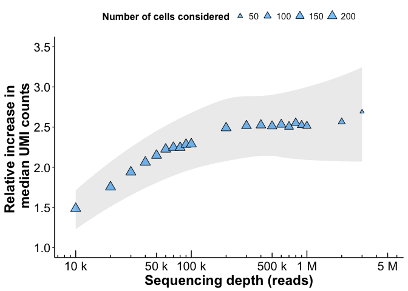
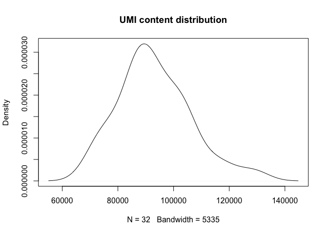
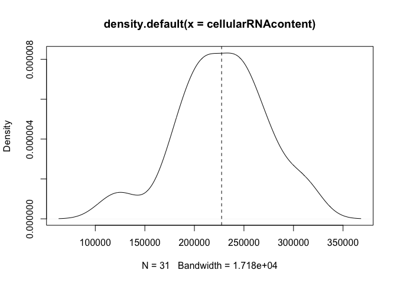
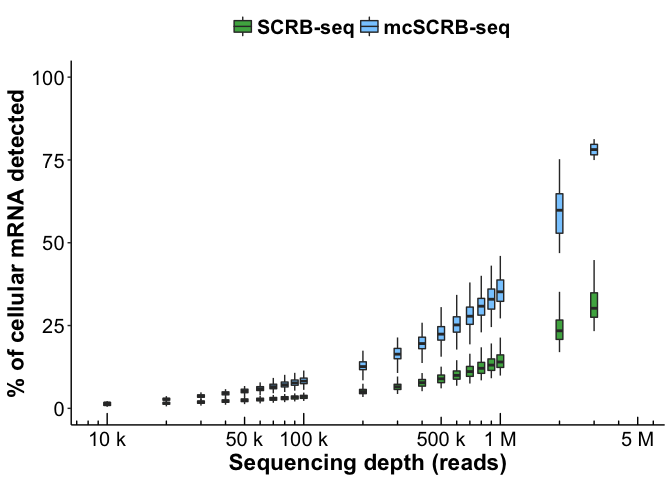

Figure 4: Sensitivity
================

Use this code to reproduce Figure 4 from Bagnoli et al., 2017.

Step 1: load required packages & functions:

``` r
pckgs <- c("here","ggplot2","dplyr","cowplot")
lapply(pckgs, function(x) suppressMessages(require(x, character.only = TRUE)))
```

    ## [[1]]
    ## [1] TRUE
    ## 
    ## [[2]]
    ## [1] TRUE
    ## 
    ## [[3]]
    ## [1] TRUE
    ## 
    ## [[4]]
    ## [1] TRUE

``` r
SCRB_col <- "#4CAF50"
SMURF_col <- "#88CCFF"
theme_pub <- theme_classic() + theme(axis.text = element_text(colour="black", size=15), 
                                     axis.title=element_text(size=17,face="bold"), 
                                     legend.text=element_text(size=15),
                                     legend.position="top",
                                     legend.key=element_blank(),
                                     legend.justification="center", 
                                     axis.line.x = element_line(colour = "black"), 
                                     axis.line.y = element_line(colour = "black"),
                                     strip.background=element_blank(), 
                                     strip.text=element_text(size=17)) 
format_si <- function(...) {
  # Format a vector of numeric values according
  # to the International System of Units.
  # http://en.wikipedia.org/wiki/SI_prefix
  #
  # Based on code by Ben Tupper
  # https://stat.ethz.ch/pipermail/r-help/2012-January/299804.html
  # Args:
  #   ...: Args passed to format()
  #
  # Returns:
  #   A function to format a vector of strings using
  #   SI prefix notation
  #
  
  function(x) {
    limits <- c(1e-24, 1e-21, 1e-18, 1e-15, 1e-12,
                1e-9,  1e-6,  1e-3,  1e0,   1e3,
                1e6,   1e9,   1e12,  1e15,  1e18,
                1e21,  1e24)
    prefix <- c("y",   "z",   "a",   "f",   "p",
                "n",   "µ",   "m",   " ",   "k",
                "M",   "G",   "T",   "P",   "E",
                "Z",   "Y")
    
    # Vector with array indices according to position in intervals
    i <- findInterval(abs(x), limits)
    
    # Set prefix to " " for very small values < 1e-24
    i <- ifelse(i==0, which(limits == 1e0), i)
    
    paste(format(round(x/limits[i], 1),
                 trim=TRUE, scientific=FALSE, ...),
          prefix[i])
  }
}
path_to_data <- here::here()
```

Step 2: load data:

``` r
JM8 <- readRDS(paste(path_to_data,"Data/JM8.rds",sep="/"))
JM8_barcodeinfo <- read.table(paste(path_to_data,"Data/barcodes_QCfilter.txt",sep="/"), header=T, sep="\t",stringsAsFactors = F)
J1_ERCC <- readRDS(paste(path_to_data,"Data/J1_ERCC.rds",sep="/"))
```

Step 3: subset to valid barcodes:

``` r
barcodespass <- JM8_barcodeinfo[which(JM8_barcodeinfo$QCpass==TRUE),]
dim(barcodespass)
```

    ## [1] 249  10

Step 4: Generate panel A

``` r
options(scipen=999) #prevent scientific notation
exprdf <- data.frame() #initialise output
for(i in c(seq(10000,90000,10000),seq(100000,1000000,100000),2000000,3000000,4000000)){ #for each downsampling depth, get the UMI counts and Gene counts
  tmp <- JM8$downsampled[[paste("downsampled_",i,sep="")]]$umicounts_downsampled #get downsampled data.frame from list object
  tmp <- tmp[,which(colnames(tmp) %in% barcodespass$XC)] #only consider valid barcides
  tmp_df <- data.frame(depth=i,UMIs=colSums(tmp),Genes=colSums(tmp>0),BC=colnames(tmp), stringsAsFactors = F) #calculate Genes/UMIs detected
  exprdf <- rbind.data.frame(exprdf,tmp_df) #collect output
}

exprdf$method <- barcodespass[match(exprdf$BC,barcodespass$XC),"method"] #add method info per barcode

#next calculate the relative increase in UMIs detected per sequencing depth
rel_increase <- data.frame(increase=as.data.frame((exprdf %>% dplyr::filter(method=="SMURF") %>% group_by(depth) %>% summarise(median(UMIs))))[,2] / as.data.frame((exprdf %>% dplyr::filter(method=="SCRB") %>% group_by(depth) %>% summarise(median(UMIs))))[,2],
                           sd=as.data.frame((exprdf %>% dplyr::filter(method=="SMURF") %>% group_by(depth) %>% summarise(sd(UMIs))))[,2] / as.data.frame((exprdf %>% dplyr::filter(method=="SCRB") %>% group_by(depth) %>% summarise(median(UMIs))))[,2],
                           depth=c(seq(10000,90000,10000),seq(100000,1000000,100000),2000000,3000000,4000000),
                           nobs=as.data.frame(exprdf  %>% group_by(depth) %>% summarise(length(UMIs)))[,2],stringsAsFactors = F)

#make a temporary plot to extract the confidence interval
tmp_p <- ggplot(rel_increase[which(rel_increase$depth<4000000),],aes(x=depth,y=increase,size=nobs)) + scale_x_log10(labels=format_si(),breaks=c(10000,50000,100000,500000,1000000,5000000),limits=c(9000,7000000))+ stat_smooth(aes(x=depth,y=(increase-sd)),method="loess",se=F) +  stat_smooth(aes(x=depth,y=increase+sd),method="loess",se=F)
tmp_p <- ggplot_build(tmp_p)
tmp_df_rel <- data.frame(x=tmp_p$data[[1]]$x,ymin=tmp_p$data[[1]]$y,ymax=tmp_p$data[[2]]$y) #store output in a data.frame

#plot the relative increase in sensitivity
p_Fig4a <- ggplot(rel_increase[which(rel_increase$depth<4000000),],aes(x=depth,y=increase,size=nobs)) + 
                  geom_point(shape=24,fill=SMURF_col)+theme_pub +
                  xlab("Sequencing depth (reads)") + ylab("Relative increase in \n median UMI counts") + 
                  scale_x_log10(labels=format_si(),breaks=c(10000,50000,100000,500000,1000000,5000000),limits=c(9000,5000000))  + 
                  theme(legend.position = "top",axis.ticks.x=element_line(size=0),legend.text = element_text(size=11),legend.title = element_text(size=12,face="bold")) + 
                  labs(size="Number of cells considered") + ylim(1,3.5) + annotation_logticks(sides="b",base=10) + 
                  scale_size_continuous(range=c(1.5,4)) + 
                  geom_ribbon(data=tmp_df_rel,aes(x=10^x,ymin=ymin,ymax=ymax),alpha=0.1,inherit.aes = F)
p_Fig4a
```



Step 5: Preprocess ERCC data

``` r
J1_ERCC_expr <- J1_ERCC$downsampled$downsampled_1000000$umicounts_downsampled #get data at 1 mio reads
plot(density(colSums(J1_ERCC_expr)),main = "UMI content distribution") #check distribution of UMI counts per cell 
```



``` r
J1_ERCC_expr<-J1_ERCC_expr[,which(colSums(J1_ERCC_expr)>60000 & colSums(J1_ERCC_expr)<120000)] # subset to good barcodes
selcted_bcs <- colnames(J1_ERCC_expr) 
```

Step 6: Estimate cellular mRNA content

``` r
ERCC_detect_fract <- colSums(J1_ERCC_expr[grep("ERCC",row.names(J1_ERCC_expr)),selcted_bcs])/77923 #77923 is the number of spiked ERCC molecules
ens_umis <- colSums(J1_ERCC_expr[grep("ENSMUS",row.names(J1_ERCC_expr)),selcted_bcs])
cellularRNAcontent <- ens_umis/ERCC_detect_fract
plot(density(cellularRNAcontent))
abline(v = median(cellularRNAcontent),lty="dashed")
```



Step 7: Generate Panel B: UMI detection vs mRNA content

``` r
p_Fig4b <- ggplot(exprdf[which(exprdf$depth<4000000),],aes(x=depth,y=(UMIs/median(cellularRNAcontent)*100),fill=method,group=interaction(depth,method))) + 
                  theme_pub + geom_boxplot(outlier.shape = NA,position = "identity") +  
                  scale_x_log10(labels=format_si(),breaks=c(10000,50000,100000,500000,1000000,5000000),limits=c(9000,5000000))+ 
                  ylim(0,100) + ylab("% of cellular mRNA detected") + xlab("Sequencing depth (reads)") + 
                  scale_fill_manual(values = c(SCRB_col,SMURF_col),labels=c("SCRB-seq","mcSCRB-seq"))  + 
                  annotation_logticks(sides="b",base=10)+ 
                  theme(legend.position = "top", legend.title = element_blank(),legend.text = element_text(face="bold"),axis.ticks.x=element_line(size=0))
p_Fig4b
```



Step 8: Save final plot

``` r
p_Fig4 <- plot_grid(p_Fig4a,p_Fig4b,align = "hv",labels=c("A","B"),nrow = 2)
ggsave(p_Fig4,filename = paste(path_to_data,"PDF_output","Figure4.pdf",sep="/"),device="pdf",width = 8,height = 10)
```
