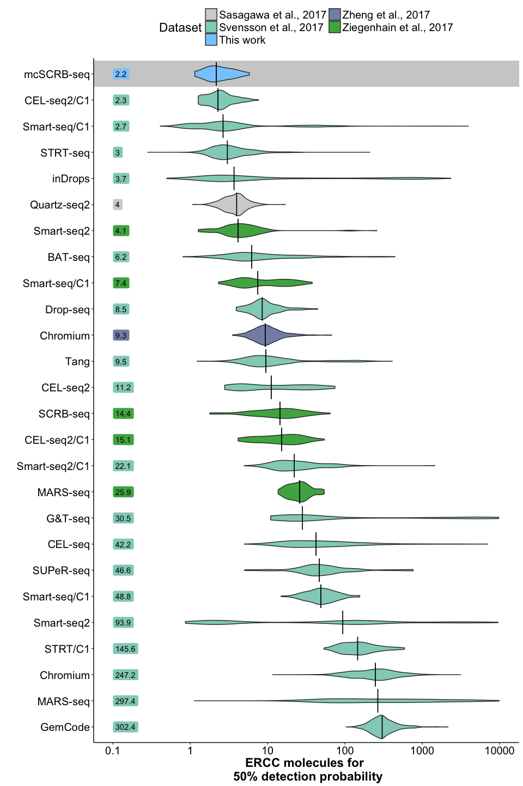
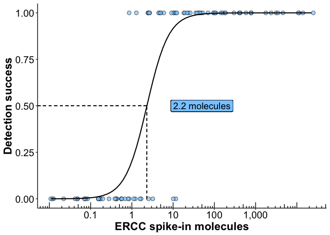
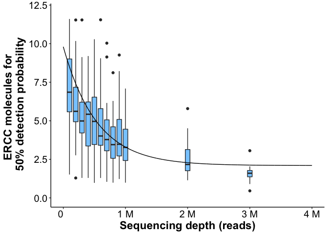

Figure 5: ERCCs
================

Use this code to reproduce Figure 5 from Bagnoli et al., 2017.

Step 1: load required packages & functions:

``` r
# Load Packages & Functions -----------------------------------------------
pckgs <- c("here","ggplot2","dplyr","cowplot","MASS")
lapply(pckgs, function(x) suppressMessages(require(x, character.only = TRUE)))
```

    ## [[1]]
    ## [1] TRUE
    ## 
    ## [[2]]
    ## [1] TRUE
    ## 
    ## [[3]]
    ## [1] TRUE
    ## 
    ## [[4]]
    ## [1] TRUE
    ## 
    ## [[5]]
    ## [1] TRUE

``` r
SCRB_col <- "#4CAF50"
SMURF_col <- "#88CCFF"
theme_pub <- theme_classic() + theme(axis.text = element_text(colour="black", size=15), 
                                     axis.title=element_text(size=17,face="bold"), 
                                     legend.text=element_text(size=15),
                                     legend.position="top",
                                     legend.key=element_blank(),
                                     legend.justification="center", 
                                     axis.line.x = element_line(colour = "black"), 
                                     axis.line.y = element_line(colour = "black"),
                                     strip.background=element_blank(), 
                                     strip.text=element_text(size=17)) 

format_si <- function(...) {
  # Format a vector of numeric values according
  # to the International System of Units.
  # http://en.wikipedia.org/wiki/SI_prefix
  #
  # Based on code by Ben Tupper
  # https://stat.ethz.ch/pipermail/r-help/2012-January/299804.html
  # Args:
  #   ...: Args passed to format()
  #
  # Returns:
  #   A function to format a vector of strings using
  #   SI prefix notation
  #
  
  function(x) {
    limits <- c(1e-24, 1e-21, 1e-18, 1e-15, 1e-12,
                1e-9,  1e-6,  1e-3,  1e0,   1e3,
                1e6,   1e9,   1e12,  1e15,  1e18,
                1e21,  1e24)
    prefix <- c("y",   "z",   "a",   "f",   "p",
                "n",   "µ",   "m",   " ",   "k",
                "M",   "G",   "T",   "P",   "E",
                "Z",   "Y")
    
    # Vector with array indices according to position in intervals
    i <- findInterval(abs(x), limits)
    
    # Set prefix to " " for very small values < 1e-24
    i <- ifelse(i==0, which(limits == 1e0), i)
    
    paste(format(round(x/limits[i], 1),
                 trim=TRUE, scientific=FALSE, ...),
          prefix[i])
  }
}

path_to_data <- here::here()
```

Step 2: load and process the Svensson et al., 2017 data

``` r
#here, we used the published molecular detection limits from the supplement
svensson <- read.csv(paste(path_to_data,"Data/nmeth.4220-S3.csv",sep="/"),stringsAsFactors = F)

#remove bulk and freeze/thaw data
svensson_sub <- svensson[-grep("thaw",svensson$protocol),]
svensson_sub <- svensson_sub[-grep("overnight",svensson_sub$protocol),]
svensson_sub <- svensson_sub[-grep("Bulk",svensson_sub$protocol),]

#remove cells with failed binomial regression
svensson_sub<- svensson_sub[-which(svensson_sub$molecule_limit==Inf),]

svensson_sub_for_merge <- svensson_sub[,c("protocol","molecule_limit")] # we only need the protocol and detection limt
svensson_sub_for_merge$study = "Svensson et al., 2017"
```

Step 3: load and process the mcSCRB-seq data

``` r
J1_ERCC_all <- readRDS(paste(path_to_data,"Data/J1_ERCC.rds",sep="/"))
J1_ERCC <- J1_ERCC_all$downsampled$downsampled_2000000$umicounts_downsampled
J1_ERCC <- J1_ERCC[grep("ERCC",row.names(J1_ERCC)),]

#load the ERCC molecule annotation for our experiments
ERCCannot <- read.table(paste(path_to_data,"Data/ERCC_molecules_J1.txt",sep="/"),header=T,stringsAsFactors = F)

#for each cell, run a logistic binomial regression
for(i in 1:ncol(J1_ERCC)){
  if(i==1){out_vec <- c()}
  ercctmp <- ERCCannot[,c(1,2)]
  ercctmp <- ercctmp[match(row.names(J1_ERCC),ercctmp$gERCC_ID),]
  ercctmp$success <- as.numeric(J1_ERCC[,i]>0)
  ercctmp$fail <- as.numeric(J1_ERCC[,i]==0)
  glm.model <- glm(success~ log10(molecules),family=binomial(logit), data=ercctmp)
  dose.out <- dose.p(glm.model, cf = 1:2, p = 0.5)
  out_vec <- c(out_vec,10^dose.out[1])
}


mcSCRB_df <- data.frame(protocol="mcSCRB-seq",molecule_limit=out_vec,stringsAsFactors = F)
mcSCRB_df$study = "This work"
```

Step 4: load and process the Sasagawa et al., 2017 (Quartz-seq2) data

``` r
#downloaded mESC plate containing ERCCs (GSM2656466)
quartzseq <- read.table(paste(path_to_data,"Data/Quartzseq2.GSM2656466_ESPrE_plate6_RT25_384well.txt",sep="/"),header=T,row.names=1)
quartzseq <- quartzseq[grep("ERCC",row.names(quartzseq)),]

#read in the general ERCC annotation
ercc_annot <- read.table(paste(path_to_data,"Data/ERCC_annotation.txt",sep="/"), header=T, stringsAsFactors = F,sep="\t")
ercc_annot <- ercc_annot[,c(2,4)]
avogadrosnum <- 6.022140857*10^23
ercc_annot$moleculesperul <- ercc_annot$concentration.in.Mix.1..attomoles.ul.*avogadrosnum*10^-18


dilutionfactor <- (6*0.1*0.001*0.001) # need to insert dilution here
for(i in 1:ncol(quartzseq)){
  if(i==1){out_vec <- c()}
  ercctmp <- ercc_annot[,c(1,3)]
  ercctmp$molecules <- ercctmp$moleculesperul*dilutionfactor
  ercctmp <- ercctmp[match(row.names(quartzseq),ercctmp$ERCC.ID),]
  ercctmp$success <- as.numeric(quartzseq[,i]>0)
  ercctmp$fail <- as.numeric(quartzseq[,i]==0)
  glm.model <- glm(success~ log10(molecules),family=binomial(logit), data=ercctmp)
  dose.out <- dose.p(glm.model, cf = 1:2, p = 0.5)
  out_vec <- c(out_vec,10^dose.out[1])
}
quartzdf <- data.frame(protocol="Quartz-seq2",molecule_limit=out_vec,stringsAsFactors = F)
quartzdf$study = "Sasagawa et al., 2017"
```

Step 5: load and process the Ziegenhain et al., 2017 data

``` r
#here we use the published data from GEO accession GSE75790
ziegenhain <-  read.table(paste(path_to_data,"Data/GSE75790_ziegenhain_complete_data.txt",sep="/"), header=T,row.names=1)
ziegenhain <- ziegenhain[grep("ERCC",row.names(ziegenhain)),]
row.names(ziegenhain) <- substr(row.names(ziegenhain),2,nchar(row.names(ziegenhain))) #fix rownames
ziegenhain <- ziegenhain[,-grep("Drop",colnames(ziegenhain))] #Drop-seq does not contain ERCCs, so discard

#use colnames for generating annotation of samples
tmpsplit <- t(data.frame(strsplit(colnames(ziegenhain),"_"),stringsAsFactors = F))[,1]
z.annot<- substr(tmpsplit,1,nchar(tmpsplit)-1)

#read in the molecule abundances per method
ercc.molecules.z <- read.table(file=paste(path_to_data,"Data/ERCC_molecules_Ziegenhain2017.txt",sep="/"), header=T, sep="\t", stringsAsFactors = F)


#First run estimation for Smart-seq2 data
ziegenhain_part1 <- ziegenhain[,grep("SmartSeq2",colnames(ziegenhain))]

for(i in 1:ncol(ziegenhain_part1)){
  if(i==1){out_vec <- c()}
  ercctmp <- ercc.molecules.z
  ercctmp <- ercctmp[match(row.names(ziegenhain_part1),ercctmp$ERCC_ID),]
  ercctmp$success <- as.numeric(ziegenhain_part1[,i]>0)
  ercctmp$fail <- as.numeric(ziegenhain_part1[,i]==0)
  glm.model <- glm(success~ log10(Smart2),family=binomial(logit), data=ercctmp)
  dose.out <- dose.p(glm.model, cf = 1:2, p = 0.5)
  out_vec <- c(out_vec,10^dose.out[1])
}
ziegenhain_part1_df <- data.frame(protocol="Smart-seq2",molecule_limit=out_vec,stringsAsFactors = F)


#Now run for the other methods
ziegenhain_part2 <- ziegenhain[,-grep("SmartSeq2",colnames(ziegenhain))]

for(i in 1:ncol(ziegenhain_part2)){
  if(i==1){out_vec <- c()}
  ercctmp <- ercc.molecules.z
  ercctmp <- ercctmp[match(row.names(ziegenhain_part2),ercctmp$ERCC_ID),]
  ercctmp$success <- as.numeric(ziegenhain_part2[,i]>0)
  ercctmp$fail <- as.numeric(ziegenhain_part2[,i]==0)
  glm.model <- glm(success~ log10(SCRB),family=binomial(logit), data=ercctmp)
  dose.out <- dose.p(glm.model, cf = 1:2, p = 0.5)
  out_vec <- c(out_vec,10^dose.out[1])
}
ziegenhain_part2_df <- data.frame(protocol=z.annot[-grep("SmartSeq2",z.annot)],molecule_limit=out_vec,stringsAsFactors = F)

ziegenhain_df <- rbind(ziegenhain_part1_df,ziegenhain_part2_df)
ziegenhain_df$study = "Ziegenhain et al., 2017"
```

Step 6: load and process the Chromium (Zheng et al., 2017) data

``` r
#data obtained from https://support.10xgenomics.com/single-cell-gene-expression/datasets/1.1.0/ercc
ERCC10x <- read.table(paste(path_to_data,"Data/ERCCs10x_matrix.mtx",sep="/"), header = F,stringsAsFactors = F,skip = 3)

#since the data is stored in long format, we should spread it..
colnames(ERCC10x) <- c("ERCC_ID","Cell","UMI")
ERCC10x_wide <- reshape2::dcast(ERCC10x,formula = ERCC_ID~Cell,fill=0)
row.names(ERCC10x_wide) <- sort(ercc_annot$ERCC.ID)[ERCC10x_wide$ERCC_ID]
ERCC10x_wide <- ERCC10x_wide[,-1]


#calculate molecular detection limits..
dilutionfactor<- 0.000025/10 #in case of 10xGenomics, this is droplet size multiplied by dilution (1/10)
for(i in 1:ncol(ERCC10x_wide)){
  if(i==1){out_vec <- c()}
  ercctmp <- ercc_annot[,c(1,3)]
  ercctmp$molecules <- ercctmp$moleculesperul*dilutionfactor
  ercctmp <- ercctmp[match(row.names(ERCC10x_wide),ercctmp$ERCC.ID),]
  ercctmp$success <- as.numeric(ERCC10x_wide[,i]>0)
  ercctmp$fail <- as.numeric(ERCC10x_wide[,i]==0)
  glm.model <- glm(success~ log10(molecules),family=binomial(logit), data=ercctmp)
  dose.out <- dose.p(glm.model, cf = 1:2, p = 0.5)
  out_vec <- c(out_vec,10^dose.out[1])
}
tenxdf <- data.frame(protocol="Chromium ",molecule_limit=out_vec,stringsAsFactors = F)
tenxdf$study = "Zheng et al., 2017"
```

Step 7: merge all the data and plot

``` r
mergeddf <- rbind(svensson_sub_for_merge,mcSCRB_df,quartzdf,tenxdf,ziegenhain_df)
#sort according to molecular detection limit..
annotdf_merge <- as.data.frame(mergeddf %>% group_by(protocol,study) %>% summarise(limdet=median(molecule_limit)))
mergeddf$protocol_sort <- factor(mergeddf$protocol,levels = annotdf_merge$protocol[order(annotdf_merge$limdet,decreasing = T)])


p_Fig5c <- ggplot(mergeddf,aes(x=protocol_sort,y=molecule_limit,fill=study)) + 
  geom_rect(xmin=25.5,xmax=26.5,ymin=-100,ymax=10000,fill="lightgrey",alpha=0.1) +
  geom_violin(alpha=1)+xlab("") + 
  scale_y_log10(labels=c(0.1,1,10,100,1000,10000),limits=c(0.1,10000),breaks=c(0.1,1,10,100,1000,10000))  + 
  scale_x_discrete(labels=c("GemCode","MARS-seq","Chromium","STRT/C1","Smart-seq2","Smart-seq/C1","SUPeR-seq","CEL-seq","G&T-seq","MARS-seq","Smart-seq2/C1","CEL-seq2/C1","SCRB-seq","CEL-seq2","Tang","Chromium","Drop-seq","Smart-seq/C1","BAT-seq","Smart-seq2","Quartz-seq2","inDrops","STRT-seq","Smart-seq/C1","CEL-seq2/C1","mcSCRB-seq"))+
  stat_summary(geom = "errorbar",fun.y = median,fun.ymax = median,fun.ymin = median) + 
  geom_label(data=annotdf_merge,aes(x=protocol,y=0.1,label=round(limdet,1),fill=study,hjust="left"),show.legend = F,inherit.aes = F,label.size = unit(0,"lines")) + 
  ylab("ERCC molecules for \n 50% detection probability") + 
  coord_flip()  + 
  theme_pub+
  theme(legend.position = "top",legend.title = element_text(size=17)) + 
  scale_fill_manual(values = c("lightgrey",ggsci::pal_npg()(9)[7],"#88CCFF",ggsci::pal_npg()(9)[6],"#4CAF50"),name="Dataset") +guides(fill=guide_legend(nrow=3))
p_Fig5c
```



Step 8: Example plot for binomial logistic regression

``` r
ercctmp <- ERCCannot[,c(1,2)]
ercctmp$success<-0
ercctmp[match(row.names(J1_ERCC),ercctmp$gERCC_ID),"success"] <- as.numeric(J1_ERCC[,13]>0)
glm.model <- glm(success~ log10(molecules),family=binomial(logit), data=ercctmp)
dose.out <- dose.p(glm.model, cf = 1:2, p = 0.5)

p_Fig5a <- ggplot(ercctmp,aes(x=molecules,y=success)) + 
  geom_jitter(width = 0.1,height = 0.0,size=2.5,alpha=0.66,shape=21,fill=SMURF_col) + theme_pub+ 
  xlab("ERCC spike-in molecules") + scale_x_log10(labels=c("0.1","1","10","100","1,000"),breaks=c(0.1,1,10,100,1000)) + 
  ylab("Detection success") + geom_segment(aes(x=10^dose.out[1],xend=10^dose.out[1],y=0,yend=0.5),linetype="dashed")+ 
  geom_segment(aes(x=0,xend=10^dose.out[1],y=0.5,yend=0.5),linetype="dashed") + 
  scale_y_continuous( expand = c(0,0.05), limits = c(0,1) ) + 
  geom_label(aes(x=50,y=0.5,label="2.2 molecules"),size=5,fill=SMURF_col) + 
  stat_smooth(method=glm, method.args = list(family="binomial"), se=F, alpha=0.2, size=0.75,color="black") + 
  annotation_logticks(sides = "b")
p_Fig5a
```



Step 9: mcSCRB-seq detection limit vs sequencing

``` r
selcted_bcs <- colnames(J1_ERCC)

options(scipen=999) #prevent scientific notation
#initialise loop over sequencing depths and output:
depht_vec <- c(seq(100000,1000000,100000),2000000,3000000)
out_ERCClogit_mcSCRB <- c()
out_dp <- c()
#calculate detection limits:
for(i in depht_vec){
  tmp <- J1_ERCC_all$downsampled[[paste("downsampled_",i,sep="")]]$umicounts_downsampled #get the counts for this sequencing depth
  tmp <- tmp[,which(colnames(tmp) %in% selcted_bcs)] # only valid cell barcodes
  tmp <- tmp[grep("ERCC",row.names(tmp)),] # only ERCC expression necessary
  ercctmp <- ERCCannot[,c(1,2)]#prepare annotation
  ercctmp <- ercctmp[match(row.names(tmp),ercctmp$gERCC_ID),]
  for(j in 1:ncol(tmp)){
    ercctmp$success <- as.numeric(tmp[,j]>0)
    ercctmp$fail <- as.numeric(tmp[,j]==0)
    glm.model <- glm(success~ log10(molecules),family=binomial(logit), data=ercctmp)
    dose.out <- dose.p(glm.model, cf = 1:2, p = 0.5)
    out_ERCClogit_mcSCRB <- c(out_ERCClogit_mcSCRB,10^dose.out[1]) #collect detection limit
  }
  out_dp <- c(out_dp,rep(i,ncol(tmp))) #keep track of the sequencing depth
}

scurvedf <- data.frame(logitp=out_ERCClogit_mcSCRB,depth=out_dp) #collect outputs in one data.frame

scurvedf_plyr <- scurvedf %>% group_by(depth) %>% summarise(nobs=length(logitp),logitp=median(logitp)) #get averages

#calculate an asymptotic fit line for the data
fit.init <- NLSstAsymptotic(sortedXyData(expression(depth), expression(logitp), scurvedf)) 
fit <- nls(y ~ b0 + b1*(1-exp(-exp(lrc) * x)), data = sortedXyData(expression(depth), expression(logitp), scurvedf), start=list(b0=fit.init["b0"], b1=fit.init["b1"], lrc=fit.init["lrc"])) # being sorted is important!

fitpredict <-data.frame(logitp=predict(fit, data.frame(x=seq(0,4000000, by=1000))),depth=seq(0,4000000, by=1000)) #predict line values

p_Fig5b <- ggplot(scurvedf,aes(x=depth,y=logitp,group=depth)) + 
  geom_boxplot(fill=SMURF_col)+ theme_pub + 
  xlab("Sequencing depth (reads)") + ylab("ERCC molecules for \n 50% detection probability") + 
  ylim(0,12) + geom_line(data=fitpredict,aes(x=depth,y=logitp),inherit.aes = F,color="black") + 
  scale_x_continuous(labels=format_si())
p_Fig5b
```



Step 10: Save final plot

``` r
p_Fig5 <- plot_grid(plot_grid(p_Fig5a,p_Fig5b,nrow = 2,labels = c("A","B"),align = "hv"),p_Fig5c,ncol = 2,labels = c("","C"))
ggsave(p_Fig5,filename = paste(path_to_data,"PDF_output","Figure5.pdf",sep="/"),device="pdf",width = 15,height = 12)
```
